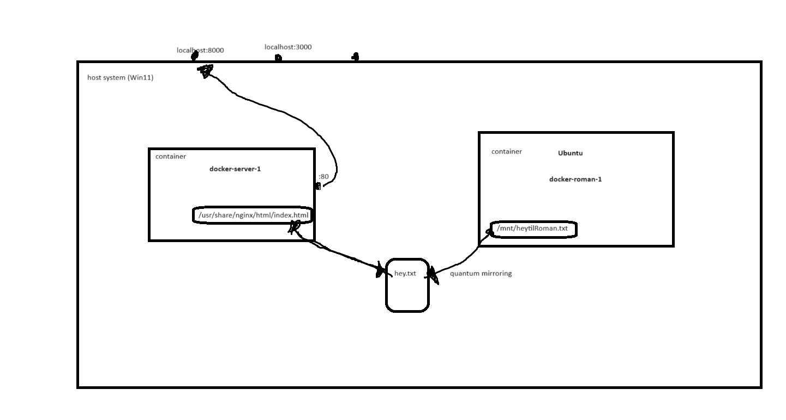

# Description



# How to use Jans Dejlige SQL Playground

## Set up and run container

Build and run the docker compose images in the background:

```shell
docker compose up -d
```

Verify that the container `docker-test-mysql-1`, using the image `mysql:latest` is running by running the command

```shell
docker ps
```

Open an interactive terminal inside the aforementioned container

```shell
docker exec -it docker-test-mysql-1 /bin/bash
```

The command line should now look something like: `bash-4.4#`

### **_Lazy shortcut if you don't want to below_**:

```shell
chmod +x /mnt/jans_sql_playground
/mnt/jans_sql_playground
```

## Populate database

Populate the database just created by:

```shell
mysql -e 'source /mnt/jans_sql_script.sql'
```

Open an MySQL terminal, use the database just created and populated, and verify that it contains the expected data:

```mysql
use dejlig_db;
select *
from person;
```

This query should output something that looks like this:

```text
+----+------------+-----------------------+-----+
| id | first_name | last_name             | age |
+----+------------+-----------------------+-----+
|  1 | Jan        | Balin                 |  29 |
|  2 | Roman      | Grygorenko            |  33 |
|  3 | Martin     | Kedmenec              |  27 |
|  4 | Mathias    | Rune Agüero Andersen |  30 |
+----+------------+-----------------------+-----+
```

## Time for joy

Now, to find out which languages these three champs speak, run the following command:

```shell
mysql -e 'source /mnt/jans_sql_query.sql'
```
